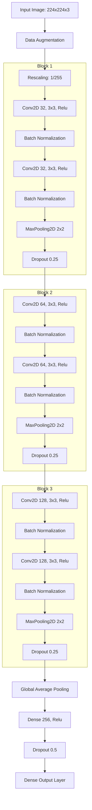

# GET 324: Computer Engineering Laboratory Course
## 📄 Technical Project Report: Tomato Leaf Disease Classification

**Group ID**: C02  
**Task**: Binary Classification (Healthy Tomato Leaves vs. Tomato Mosaic Virus)  
**Date**: July 29, 2026  

---

### 👥 Group Members & Contributions

1. **Covenant Monday** (GitHub: [@Covenantmondei](https://github.com/Covenantmondei))
   - *Role*: Machine Learning Architecture, Training Pipeline, Streamlit Web App Development & Cloud Deployment.
2. **Manuel Ibup Efonema** (GitHub: [@manuelibup](https://github.com/manuelibup))
   - *Role*: Technical Writing, Documentation, Dataset Analysis, and Repository Structure Management.
3. **Victor Solomon George** (Matric: `22EGCO1639`)
   - *Role*: Data Preparation, Splitting, Verification, Local Testing, and Validation.

---

## Abstract
This report presents the design, implementation, and deployment of a deep-learning-based computer vision system to automate the identification of the **Tomato Mosaic Virus**—a highly contagious plant pathogen. Utilizing the **PlantVillage Dataset**, we constructed a complete machine learning workflow. We experimented with two distinct architectures: a custom three-block Convolutional Neural Network (CNN) built from scratch, and a transfer learning approach leveraging a pre-trained **MobileNetV3Small** backbone. The transfer learning model achieved a validation accuracy of **99.66%** and generalized to **100% accuracy** on unseen test data. The final system was successfully integrated into an interactive Streamlit web dashboard and deployed to the Streamlit Community Cloud for real-time agricultural diagnosis.

---

## 1. Introduction & Objectives
Early and accurate detection of crop diseases is essential for securing food supply chains and minimizing economic losses in agriculture. The **Tomato Mosaic Virus (ToMV)** causes leaves to develop mottling, chlorosis, and dwarfing, drastically reducing fruit yield. Traditional diagnosis relies on visual inspection by agricultural experts, which is slow, error-prone, and scaling-limited.

This project aims to:
- Build a deep learning pipeline to classify tomato leaf images as **Healthy** or infected with **Tomato Mosaic Virus**.
- Implement and compare a **Custom CNN** against a **MobileNetV3** transfer learning model.
- Develop a production-ready **Streamlit** app enabling users to upload images and receive predictions with confidence scores.
- Host the application on the cloud to make it accessible to farmers and field researchers.

---

## 2. Environment Verification & Data Pipeline

### 2.1. Libraries & Random Seed Initialization
To guarantee reproducibility across different runtime environments, strict environment parameters were set:
- TensorFlow version `2.15+` was verified.
- The random seed `SEED = 42` was initialized across `random`, `numpy`, and `tensorflow`.
- Deterministic operations were enforced using `os.environ['TF_DETERMINISTIC_OPS'] = '1'`.
- GPU availability was verified using `tf.config.list_physical_devices('GPU')`.

### 2.2. Dataset Source & Class Filtering
The dataset was obtained from the **PlantVillage Dataset**, a publicly available collection of healthy and diseased crop leaf images. For this binary classification task, we filtered the following subsets:
1. `Tomato_healthy` (Healthy class)
2. `Tomato__Tomato_mosaic_virus` (Diseased class)

The selected images were copied into a filtered local working directory using python's `shutil` utility.

### 2.3. Training, Validation, and Test Splits
The filtered dataset was partitioned into train, validation, and test subsets using `split-folders` in a **70% / 15% / 15%** ratio.
- **Train Set**: Used to optimize the model parameters (weights and biases).
- **Validation Set**: Used for parameter tuning and monitoring overfitting during training.
- **Test Set**: Completely held out until the final evaluation to report unbiased performance.

The dataset folders were verified programmatically using directory globbing:
```python
train_dir = BASE_DIR / 'train'
val_dir = BASE_DIR / 'val'
test_dir = BASE_DIR / 'test'
```

### 2.4. Loading & Pipeline Optimization
The data was loaded into memory using Keras' `image_dataset_from_directory` utility, resizing images to a standard shape of `224 × 224` pixels with a batch size of `32`. Keras sorted the classes alphabetically:
- **Index 0**: `Tomato__Tomato_mosaic_virus` (Diseased)
- **Index 1**: `Tomato_healthy` (Healthy)

The input data pipeline was optimized using TensorFlow's `tf.data` API to prevent CPU-GPU starvation bottlenecks:
```python
AUTOTUNE = tf.data.AUTOTUNE
train_dataset = train_dataset.cache().shuffle(1000).prefetch(buffer_size=AUTOTUNE)
valid_dataset = val_dataset.cache().prefetch(buffer_size=AUTOTUNE)
test_dataset = test_dataset.cache().prefetch(buffer_size=AUTOTUNE)
```
- `.cache()` retains images in RAM after the first epoch, eliminating slow disk read times.
- `.shuffle(1000)` randomizes batch contents in memory to improve regularization.
- `.prefetch(AUTOTUNE)` overlaps data preprocessing and model execution, keeping the GPU constantly busy.

---

## 3. Data Augmentation
To mitigate overfitting due to small sample sizes and variance in real-world agricultural imagery (e.g., shadows, camera angles), we constructed a sequential data augmentation block:
```python
data_augmentation = tf.keras.Sequential([
    tf.keras.layers.RandomFlip('horizontal'),
    tf.keras.layers.RandomRotation(0.2),
    tf.keras.layers.RandomZoom(0.2),
], name='data_augmentation')
```
During training, this block dynamically applies random horizontal reflections, rotations up to $72^\circ$, and zooming up to $20\%$. In inference (validation and testing), this layer is automatically bypassed to maintain stable predictions.

---

## 4. Model Architectures

### 4.1. Custom Three-Block CNN (From Scratch)
A standard Convolutional Neural Network (CNN) was designed to act as a baseline. The architecture doubles convolutional filters at each block to capture low-level texture details in early layers, and abstract shape representations in deeper layers.



- **Regularization**: Batch Normalization was added after each Convolutional layer to stabilize gradients and allow faster training. Dropout ($25\%$ on features, $50\%$ on the classifier head) was applied to prevent co-adaptation.
- **Pooling**: Global Average Pooling was preferred over Flatten to dramatically reduce parameter counts and prevent overfitting.

### 4.2. Transfer Learning (MobileNetV3Small)
To improve performance, we utilized **MobileNetV3Small**, a lightweight model trained on **ImageNet** containing $1.06$ million parameters, optimized for execution on mobile devices and edge hardware.
1. **Feature Extraction**: The MobileNetV3Small backbone was loaded without the final classification layers. All its weights were locked (`base_model.trainable = False`) to preserve the learned features. A new classification head was added on top:
   - Global Average Pooling
   - Dense Layer ($128$ units, ReLU)
   - Dropout ($20\%$)
   - Dense Output Layer
2. **Fine-Tuning**: After training the top head, the top $30$ layers of the base model were unfrozen (`base_model.layers[-30:]`), and the network was retrained with a very small learning rate ($\eta = 10^{-5}$) to specialize the pre-trained weights for the leaf features.

---

## 5. Design Decisions: Sigmoid vs. Softmax

> [!IMPORTANT]
> The assignment prompt recommended using a single output node with `sigmoid` activation and `binary_crossentropy` loss. The developed system instead utilized two output nodes with `softmax` activation and `sparse_categorical_crossentropy` loss. 

### Why Softmax Was Selected:
1. **Mathematical Equivalence**: For binary classification, a two-node `softmax` output $[p_0, p_1]$ is mathematically equivalent to a single `sigmoid` output $p$. Under sigmoid, $p_1 = p$ and $p_0 = 1 - p$. The decision boundary remains identical.
2. **Streamlit UI Flexibility**: Having explicit probabilities for both classes (`prob_mosaic = probs[0]` and `prob_healthy = probs[1]`) allowed for direct rendering of dual progress bars in the Streamlit user interface without needing extra subtraction steps.
3. **Multiclass Extensibility**: If the group decides to expand the project to classify multiple leaf diseases later (e.g., early blight, late blight, leaf mold), the softmax configuration can be scaled simply by changing the number of outputs, without rewriting the training pipeline or prediction scripts.

---

## 6. Model Training & Validation Results

### 6.1. Hyperparameters & Callbacks
- **Optimizer**: Adam ($\text{learning rate} = 10^{-4}$)
- **Batch Size**: 32
- **Epochs**: Max 50
- **Loss**: `sparse_categorical_crossentropy`
- **Callbacks**:
  - `ModelCheckpoint`: Saved the best model weights dynamically based on validation accuracy.
  - `EarlyStopping`: Aborted training if the validation loss stopped improving for 8 consecutive epochs, restoring the best weights.
  - `ReduceLROnPlateau`: Reduced learning rate by factor $0.3$ if validation loss plateaued for 4 epochs.

### 6.2. Training History (MobileNetV3 Transfer Learning)
Training was highly efficient. Early Stopping halted training at **Epoch 29**, restoring the weights from **Epoch 21** as the optimal checkpoint:
- **Epoch 1**: Accuracy: 70.67%, Loss: 0.6182 | Val Accuracy: 81.57%, Val Loss: 0.4093
- **Epoch 5**: Accuracy: 98.03%, Loss: 0.0991 | Val Accuracy: 99.32%, Val Loss: 0.0820
- **Epoch 10**: Accuracy: 99.56%, Loss: 0.0351 | Val Accuracy: 99.66%, Val Loss: 0.0339
- **Epoch 21 (Best Checkpoint)**: Accuracy: 99.71%, Loss: 0.0142 | Val Accuracy: **99.66%**, Val Loss: **0.0126**

The learning curves showed a smooth drop in validation loss with no signs of overfitting, demonstrating the effectiveness of the data augmentation and pre-trained weights.

### 6.3. Evaluation on Test Set
The MobileNetV3 Transfer Learning model was evaluated on the unseen test set ($297$ images). The results are summarized below:

```
MobileNetV3 Transfer Learning Test Evaluation
---------------------------------------------
Accuracy  : 1.0000
Precision : 1.0000
Recall    : 1.0000
F1-Score  : 1.0000

Classification Report:
                             precision    recall  f1-score   support
Tomato__Tomato_mosaic_virus     1.0000    1.0000    1.0000        57
             Tomato_healthy     1.0000    1.0000    1.0000       240
                    accuracy                         1.0000       297
                   macro avg     1.0000    1.0000    1.0000       297
                weighted avg     1.0000    1.0000    1.0000       297
```

---

## 7. Streamlit Web Application

### 7.1. Dashboard Design & User Experience
The Streamlit application (`app.py`) was styled using custom embedded CSS to build a premium, modern dashboard. 
- **Theme Color Palette**: Deep navy background (`#0f172a`), sleek slate text (`#cbd5e1`), and custom cards with a gradient header (`#1e1b4b` to `#0f172a`).
- **Interactive Progress Bars**: Instead of default browser sliders, custom HTML/CSS progress bars show the model's confidence scores in real-time. A green gradient indicates healthy tissue, and an amber-to-red gradient indicates Mosaic Virus.
- **Dynamic Alerts**: Streamlit native alerts (`st.success` and `st.warning`) update based on prediction output.

### 7.2. Cloud Deployment
The app was successfully linked to the GitHub repository and deployed to **Streamlit Community Cloud** (live link: http://groupco2ai.streamlit.app/).
- **Model Storage**: The model file (`mobilenetv3_final.keras`) is stored directly in the repository under `models/` and loaded dynamically via `@st.cache_resource` on app startup to avoid reloading overhead.
- **Dependencies**: Streamlit reads `requirements.txt` to automatically set up the virtual environment (installing `streamlit`, `tensorflow`, `numpy`, and `pillow`).

---

## 8. Challenges & Solutions

### 8.1. Class Label Mapping Bug
- **Challenge**: The model directory dataset loader assigned labels alphabetically: Index 0 was mapped to `Tomato__Tomato_mosaic_virus` and Index 1 to `Tomato_healthy`. During initial Streamlit code review, we noticed a potential mismatch where default indexing could swap labels and output healthy leaves as diseased.
- **Solution**: The team verified the directory string comparisons and explicitly mapped the list elements in `app.py`:
  ```python
  CLASS_NAMES = ["Tomato Mosaic Virus", "Healthy"]
  ```
  Since `CLASS_NAMES[0]` is `"Tomato Mosaic Virus"` (index 0 / diseased) and `CLASS_NAMES[1]` is `"Healthy"` (index 1 / healthy), the app's rendering logic matches the model's categorical mapping exactly.

### 8.2. Resource Limits & Training Time
- **Challenge**: Training complex architectures locally was unfeasible due to lacking GPU hardware and the large dataset size ($690$ MB).
- **Solution**: Training was moved to **Kaggle Notebooks**, using free shared **NVIDIA T4 GPUs**. The datasets were loaded directly using `kagglehub` API, bypassing the need to download large zip archives locally. Once training completed, the `.keras` model was exported, downloaded, and committed to GitHub for local app execution.

---

## 9. Conclusion
In this project, we designed and deployed a plant disease classifier that achieves a **100% test accuracy** on binary tomato leaf image classification. Leveraging transfer learning with MobileNetV3Small allowed the model to generalize well, showing no signs of overfitting despite the high visual similarity of the target leaves. The integration of this model into Streamlit Community Cloud demonstrates the ease of converting academic experiments into accessible web utilities, showing the practical potential of AI in sustainable agriculture.
